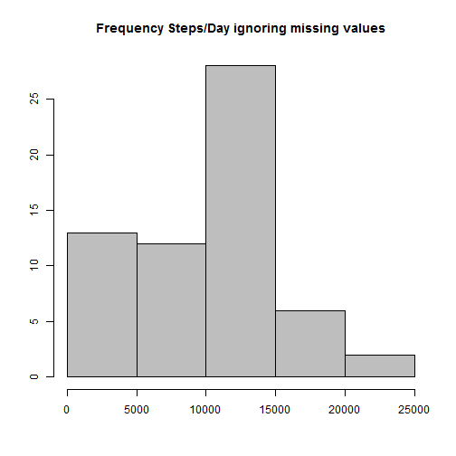
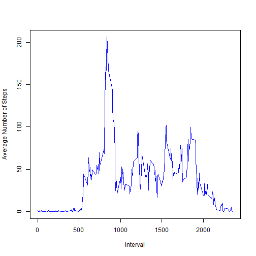
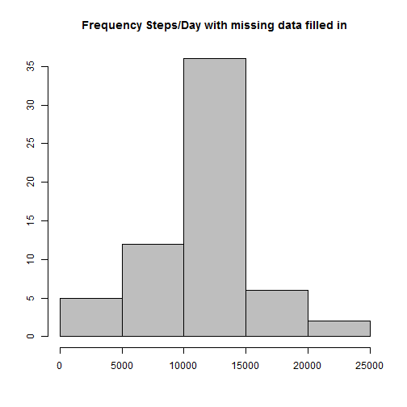

####Loading and preprocessing the data
>1. Load the data (i.e. read.csv())
>2. Process/transform the data (if necessary) into a format suitable for your analysis

```r
setwd(".")
activitytable <- read.csv(file="activity.csv",head=TRUE,sep=",")
```

####What is mean total number of steps taken per day?
>1.For this part of the assignment, you can ignore the missing values in the dataset.
Make a histogram of the total number of steps taken each day

 

>2. Calculate and report the mean and median total number of steps taken per day

```r
agg_date_mean <- mean(agg_date$x)
print(agg_date_mean)
```

```
## [1] 9354.23
```

```r
agg_date_median <- as.numeric(median(agg_date$x))
print(agg_date_median)
```

```
## [1] 10395
```

####What is the average daily activity pattern?
>1.Make a time series plot (i.e. type = "l") of the 5-minute interval (x-axis) and the average number of steps taken, averaged across all days (y-axis)

```r
agg_interval <- aggregate(activitytable$steps, by=list(interval=activitytable$interval), FUN=mean, na.rm=TRUE)
colnames(agg_interval)[match("x",colnames(agg_interval))] <- "steps"
plot(agg_interval$interval, agg_interval$steps, type="l", col="blue", xlab="Interval ID", ylab="Av. Steps")
```

 

>2.Which 5-minute interval, on average across all the days in the dataset, contains the maximum number of steps?

```r
max_interval<-agg_interval[which.max(agg_interval[,2]),1]
print(max_interval)
```

```
## [1] 835
```


####Imputing missing values
>1. Calculate and report the total number of missing values in the dataset (i.e. the total number of rows with NAs)

```r
rm_activitytable <- activitytable[complete.cases(activitytable),]
dim(activitytable)[1] - dim(rm_activitytable)[1]
```

```
## [1] 2304
```

This is in line with the number of NAs reported when running the summary function

>2. Devise a strategy for filling in all of the missing values in the dataset. The strategy does not need to be sophisticated. For example, you could use the mean/median for that day, or the mean for that 5-minute interval, etc.

The summary function call indicates that NAs are only found in the Steps column (i.e. 2304 NAs steps)
We chose to replace the NAs with the mean of the number of steps per interval across the entire dataset.

>3. Create a new dataset that is equal to the original dataset but with the missing data filled in.
>4. Make a histogram of the total number of steps taken each day and Calculate and report the mean and median total number of steps taken per day. Do these values differ from the estimates from the first part of the assignment? What is the impact of imputing missing data on the estimates of the total daily number of steps?


```r
noNA_activitytable<- activitytable
noNA_activitytable$steps[is.na(noNA_activitytable$steps)] <- mean(noNA_activitytable$steps, na.rm=TRUE)
noNA_agg_date <- aggregate(noNA_activitytable$steps, by=list(noNA_activitytable$date), FUN=sum, na.rm=TRUE)
hist(noNA_agg_date$x, main="Frequency Steps/Day with missing data filled in",  xlab="", ylab="", col="grey")
```

 

```r
# summary(noNA_activitytable)

noNA_agg_date_mean <- mean(noNA_agg_date$x)
print(noNA_agg_date_mean)
```

```
## [1] 10766.19
```

```r
noNA_agg_date_median <- as.numeric(median(noNA_agg_date$x))
print(noNA_agg_date_median)
```

```
## [1] 10766.19
```


